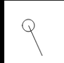

# Hit Zones

## Circular Hit Zone - Using dist()

The dist function uses 2 points and compares the distance between 2 points. It compares the first set of points x1, y1 and x2, y2. Once you have the distance, you need to use an if statement to set a threshold of when you want an action to happen.


```
background(255);
var distance = dist(mouseX, mouseY, width/2, height/2);
ellipse(width/2, height/2, 20, 20);
line(width/2, height/2, mouseX, mouseY);
if(distance < 20){
  fill("red");
}else{
  fill("white");
}
```

## Rectangular Hit Zone - Using if statements


When you want to program your own "button". You need to understand where your mouse is in relation to your "button". In this example we created a small rectangle to represent your button. We need to use an if statement to check if your mouse is located with in the 4 corners of your "button" area.

```

background(255);
rect(20, 20, 20, 20);
if(mouseX > 20 && mouseX < 40 && mouseY > 20 && mouseY < 40){
  fill("red");
}else{
  fill("white");
}
```

# For Loop

```
for(var i = 0; i < 10; i++){
  console.log(i); // prints 0 - 9
}
```

* var i = 0; (Initializor)
  * Initiates the beginning of the loop.
* i < 10; (Condition)
  * Sets the rule for when the loop should stop.
* i++ (Iterator)
  * Sets the rule for counting.

# Random


  Generates a number from start parameter to finish parameter. The upper limit of your random number is not included in the range.

  ```
    // x position 0 - (width-1), y position 0 - (height - 1)
    ellipse(random(width), random(height), 10,10);
  ```

  # millis() - Timing

  

  Allows your program to count how many milliseconds have passed since your program started running. In this example, we set an interval of 1000 milliseconds (1 second). The if statement checks to see if the difference between millis() and prevMillis is greater or equal to the interval. Once the difference is greater, prevMillis is set to millis() allowing the timing to reset.

| Millis  | prevMillis  | Interval  | Difference| True/False |
|---|---|---|---|---|
|  0 |  0 | 1000  | 0 |  F |
| 500  | 0  | 1000  | 500 | F |
| 999  | 0  | 1000  | 999 | F |
| 1000  | 0  | 1000  | 1000 | T |
| 1001  | 1000  | 1000  | 1 |  F |
| 1500  | 1000  | 1000  | 500 |  F |
| 1999  | 1000  | 1000  | 999 |  F |
| 2001  | 1000  | 1000  | 1001 |  T |
| 2002  | 2001  | 1000  | 1 |  F |

  ```
  var prevMillis = 0;
  var interval = 1000; //1 sec = 1000 milliseconds
  var counter = 0;
  function setup() {
  }

  function draw() {
    background(255);
    if(millis() - prevMillis >= interval){
      counter++;
      prevMillis = millis();
    }
      text(counter, width/2, height/2);
  }
  ```
